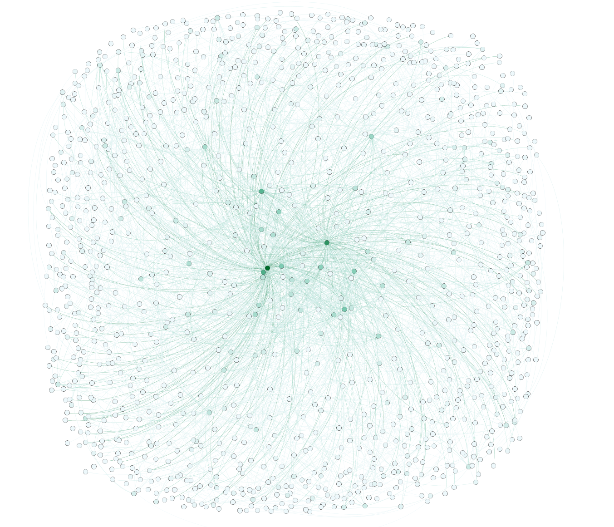

# TMTG
TMTG(Twint Mention to Graph) is tools for converting twint user mentions data to network graph for use in Gephi or others network mapping tools that support GEXF file format.

## Usage

```
usage: TMTG -c /path/csvfile.csv -g /path/write-to-file.gexf

TMTG(Twint Mention to Graph) is tools for converting twint user mentions data to network graph for use in Gephi or others network mapping tools that
support GEXF file format.

optional arguments:
  -h, --help  show this help message and exit
  -c C        Twint csv file location
  -g G        File location for writing graph file
```

## Gephi Result



## LICENSE

This software is released under the MIT License. https://opensource.org/licenses/MIT